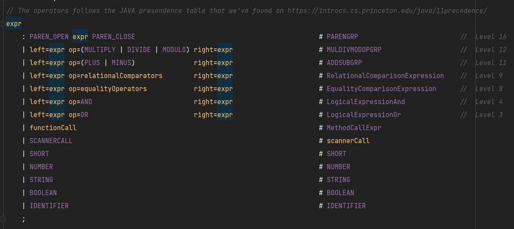

# RoC - A Romanian C based language

# Description
RoC is a C/C++/Java based programming language that has the goal to help out romanians people to:
  - code more efficient, that's due to its romanian translated syntax
  - simplified syntax compared to C/C++, but is following the same concepts

The RoC can be immediately spotted by the file extension `<file name>.rc`, as a convention the filenames should have to same name as the class within the file e.g. `MyClass.rc` would contain `MyClass` within the file. Unlike, Java RoC supports only one line comments represented by a hashtag, and the language name `#RoC`.
In order to run a program in RoC you __should have a function main__ defined in your class.

## Keywords dictionary 
This table contains all the translations of the keywords used in RoC from Romanian to English.

| Romanian    | English         |
| ------------| --------------- |
| cat timp    | while           |
| executa     | execute         |
| functia     | function/method |
| numar       | number/integer  |
| daca        | if              |
| altfel daca | else            |
| daca nu     | else if         |
| printeaza   | print           |
| returneaza  | return          |
| adevarat    | true            |
| scurt       | short           |
| fals        | false           |

## Operators

### Operators precedence
- RoC is following the operator precedence from [JAVA](https://introcs.cs.princeton.edu/java/11precedence/).



- As we can see in the picture above the highest priority in `expr` rule has the expr with parenthesis
- The multiplicative operations `* / %` have a higher priority as the additive operations `+ -`
- The relational operators `> < <= >=` have a higher priority as equality operators `= !=`
- The logical operator AND `&&` has a higher priority compared to logical operator OR `||`
- Also, as we can see the `SHORT` datatype has a higher priority compared to `NUMBER`

- Arithmetic Operators
Assume that a is 10 and b is 1

| Operator             | Description                                            | Example         |
| ---------------------| -------------------------------------------------------|-----------------|
| `-` (Subtraction)    | 	returns the difference of the values                  |	`a - b` is 9    |
| `*` (Multiplication) |	returns the product of the values                     |	`a * b` is 10   |
| `/` (Division)       |	performs division operation and returns the quotient  | `a / b` is 10   |
| `%` (Modulus)        |	performs division operation and returns the remainder | `a % b` is 0    |

- Relational Operators
Define the kind of relationship between two entities and returns a bool value in case of RoC
In this example let's assume that a is 12 and b is 50. 

| Operator | Description                                                 | Example          |
| ---------|-------------------------------------------------------------|------------------|
| `>`      | 	greater than                                               | `a > b` is false |
| `<`      |	less than                                                  | `a < b` is true  |
| `>=`     |	greater than or equal to                                   | `a >= b` is true |
| `<=`     |	less than or equal to                                      | `a <= b` is true |
| `=`      |	equal to, this operator can be used to compare two strings | `a = b` is false |
| `!=`     |	not equal                                                  | `a != b` is true |

- Logical operators

| Operator | Description            | Example          |
| ---------| --------------------   | ---------------- |
| `||`     |  Logical OR operator   | `a > b || a >=b` |
| `&&`     |  Logical AND operator  | `a < b && a > 6` |


### Scope 
The scope in RoC is described by the curly brackets `{  }`.
- `{` represents the start of a new scope
- `}` represents the end of a scope 
-The `block` rule from the grammar is going to open a new scope everytime it enters the method within the `TypeChecker.java`.
- At this moment all the functions in RoC are static therefore when we create a new function the index starts from `0`. 
Also, the argument list of a function/method has the same scope with the method body/block, and it doesn't support variable hiding.

# 1. Variables:

| Types   | Value                                 | Description                                                              |
| --------|---------------------------------------|--------------------------------------------------------------------------|
| numar   | 10, $1, 2000                          | This type can be an integer if we compare RoC to other C based languages |
| sdc     | "string"                              | Contains only strings                                                    |
| scurt   | 0, 3, 8                               | Contains only numbers from 0 to 9                                        |
| automat |  "string", 1, $12, 152, FALS/ADEVARAT | This type can decide what is the best type                               |
| bool    | ADEVARAT/FALS                         | `ADEVARAT` is true and `FALS` is false but it's translated in Romanian   | 

- RoC does not support __global variables__, supports only local variables within a function/method. 
- In RoC the negative numbers are represented with `$` so if you want to say `-12` you should declare it as `$12`.
__Why?__ Well, in real life, in my case, the only place where I see negative numbers is when I am checking y back account balance and I thought that I would be nice to represent them in my own programming language with `$`(I would change it when all the keyboards would have the EUR sign on them :D). In the `CodeGenerator.java` we handle this just by replacing the `$` with the `-`.
When assigning a value in RoC we do `numar b <- 10;`, to break down `numar` keyword represents the variable type, `b` is the identifier of the variable and `<-` is the operator which says to assign value `10` to `b`. Therefore, the mold for this would look like this `<variable type> <identifier> <- <value to assign>`. 
- _Note*:_ When declaring a new variable you have to assign a new value to it! You can't do `numar a` for declaration.

# 2 Loops

RoC supports two kind of iteration methods which are: `while` and `do while`. 


- While loop:
```
cat timp <condition> executa { 

    <do stuff>

} 
```

- Do while loop:
```
executa { 

    <do stuff>

} cat timp <condition>  
```

# 3 Conditional Expressions

- If else statements:
```
daca (<condition>) { 

  I <- I<-I+1

} altfel daca { 

I <- 3

} 
```

# 4 Methods 
The methods are following the C-like languages concepts. In RoC will be declared using the `functia` keyword followed by an identifier of the method optional will have parameters and the return type of the method. In RoC you are not __allowed to return multiple times__ you can return only at the end of the method as you should in every programming language (in my opinion), this means that you're not allowed to use the `return` in the middle of the method.
The scope of the method is provided by the curly brackets. 
- _Note*:_ to return `void` you don't have to specify something simply omit this `returneaza <type>` and also if you want to return something you have to declare a variable and then return the identifier. 
You are able to return statements like this `returneaza ADEVARAT`, `returneaza 23+2`, `returneaza "string"` or expressions in general. 

```
functia foo(<params>) returneaza <type> { 

 <do stuff>

returneaza <return variable>

} 
```

- Example:
```
functia f(numar number) returneaza numar { 

numar a<-number + 2 * 4;
returneaza a 

} 
```
# 5 Print statement
- RoC has a special method that can be called to print statements in the console.
- Within the print statement we have decided to not accept expressions, therefore you will be able to print variables and types. 

```
printeaza(<stuff to print>)
```

# 6 Scanner 
- RoC has a special method of taking values as input.
- You can take as input `numar` and `sdc` data types (`Strings` and `integers`). 
- __Why not `scurt` is not support for scanner?__ Well, because we won't be able to check if the user have entered a number from 0 to 9. Therefore, we decided to not allow this although there is a possibility for this, assigning the value to a `numar` data type and assign the value from the user to a `scurt` data type.
- Based on the datatype that is declared(`numar/sdc`) the CodeGenerator will pick the appropiate method from `Scanner` class. 
- __How does `numar a<- urmatorul` work?__ The end result would look like this in JAVA `int b = (new Scanner(System.in)).nextInt()` or `String b = (new Scanner(System.in)).nextLine()` everytime `urmatorul` keyword is called we will create a new Scanner object but is _not stored_ on the stack. 

Examples:
```
numar a<- urmatorul

sdc b<- urmatorul
```

# Program examples 

## 1 
#### Program prints the multiplied number 12 on a constant loop
```
functia getNumber() returneaza numar
{
  numar a <-a*2
  returneaza a 
}

#RoC This is a random comment
#RoC I think it's cool 

functia getNumberMultiplied(numar mult) returneaza numar
{
  numar mult<-mult*2
  returneaza mult 
}

functia main()
{
  numar a<-12
  cat timp(ADEVARAT) executa
  {
      printeaza(getNumberMultiplied(a))
      printeaza(12)
  }
}
```

## 2 
#### Example loop program
```
functia main()
{
  bool myBooleanValue<-FALS

  for numar i<-1:myBooleanValue==FALS && i<:i<-i+1 executa
  {
    printeaza(i)
  }
}
```

## 3 
#### Program to check if a number is even or odd
```
functia main(){

scanner s <- scanner
printeaza("Enter a number : ")

numar num <- s.urmatorul

daca(num % 2 = 0){
printeaza("Your number is even")
} altfel daca{
printeaza("Your number is odd")
}
}
```

## 4 
#### Program returns the factorial number of a given number
```
functia factorial(numar num) returneaza numar{
numar factorial <- 1;
numar i <- 1
cat timp(i <= num) executa
{
 factorial <- factorial*i
 i<- 1+i
}
returneaza factorial
}

functia main(){
printeaza("Introdu un numar")
scanner s<- scanner
numar num <- s.urmatorul

numar test<-factorial(num)

printeaza(num)
printeaza("factorial is : ")
printeaza(test)
}
```

## 5
#### Prints the number 2 at the power of 5
```
functia main()
{
 numar num <- 2
 numar power <- 5

 numar result <- 1

 numar index <- power

 cat timp(index != 0) executa{
 result <- num * result
 index <- index -1
 }
 printeaza(result)
}

```


# Bug list

- Our compiler has a major issue at this point when trying to nest more decission statements that the labels are not properly generated. 
- Suppose that we have the following code:
```
functia main()
{
printeaza("Leap Year Calculator")
scanner s <- scanner;
printeaza("Enter the year you want to check")

numar year <- s.urmatorul
bool leap <- FALS
    daca(year % 4 = 0)
    {
        daca(year % 100 = 0)
        {
            leap <- FALS
        }
        altfel daca
        {
            leap <- ADEVARAT
        }
    }
    altfel daca
    {
        leap <-FALS
    }
}
```
- Here is a snippet(only the if statements ) with the bytecode generated:
```
; daca(year % 4 = 0)
iload 1
ldc 4
irem
ldc 0
if_icmpne L2
; daca(year % 100 = 0)
iload 1
ldc 100
irem
ldc 0
if_icmpne L3
ldc 0
istore 2
goto endif
; altfel daca
L3:
ldc 1
istore 2
endif:
L3:
goto endif
; altfel daca
L3: ; this one should have been L2 
ldc 0
istore 2
endif:
L3:
```
- The issue with the code above is that the last else statement has the `L3` as label instead of `L2`. Which is going to cause a jasError error while compiling the bytecode file.
- Nesting if statement was the only issue that we have in the in the project because we we not able to figure out how to keep track of the depth. The only solution for in this situation would be a variable to keep track of the depth and substract from the label counter the depth `L(labelcounter - depth)`. 
